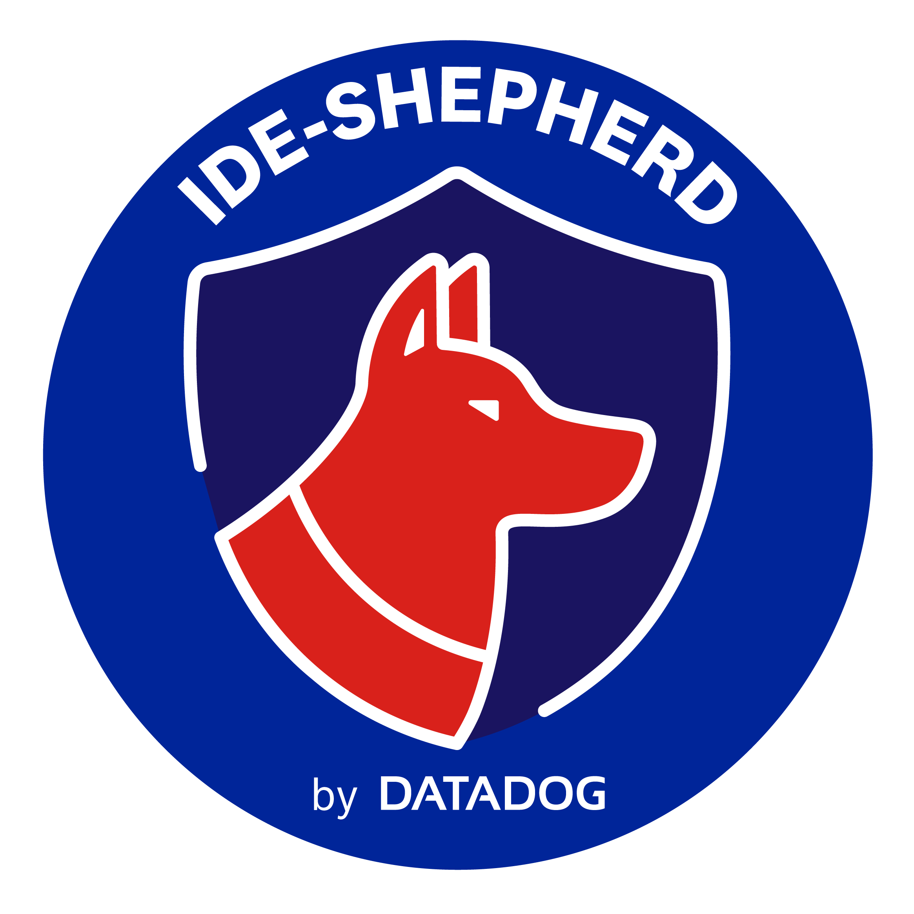
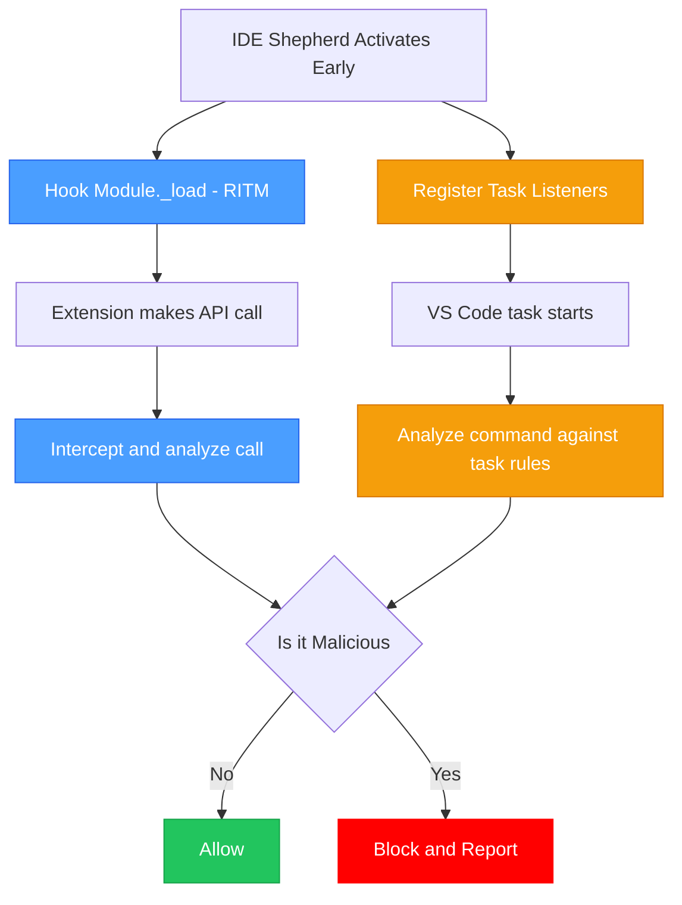

# IDE Shepherd Extension

**IDE Shepherd** is a security extension for VS Code and Cursor IDEs that detects and blocks malicious extensions and supply chain attacks — **including threats that are already installed and running**. It operates on two layers: a **runtime interception layer** that hooks Node.js primitives (`http`, `child_process`, `fs`) as they are loaded, blocking suspicious network requests, process executions, and file system access in real time; and a **static source analysis layer** that scans every `.js` file in an extension's directory — including `node_modules` — for known attack primitives such as obfuscated exec calls, download-and-execute patterns, and reverse shell signatures.

When a threat is detected, IDE Shepherd surfaces it immediately in the sidebar and gives you **granular trust controls**: allowlist a specific extension version you have reviewed, trust an entire publisher whose extensions you rely on, or mark a workspace as trusted so legitimate build tasks are never interrupted. Everything blocked by default can be explicitly permitted — putting you in control of what runs in your IDE rather than choosing between security and usability.

<p align="center">
  
</p>


> **Extension threat detection** — The **Iolite Smart Contract Plugin** is a real malicious VS Code extension that was removed from the official marketplace on March 28th, 2026. It injected heavily Unicode-obfuscated code into a bundled `node_modules` dependency to download and execute a remote payload via `child_process.exec`. IDE Shepherd intercepts the call before it runs, blocks execution, and surfaces a detailed security event in the sidebar. From that notification you can immediately add the extension to your allow list if you have reviewed it and consider it safe, or trust its publisher to exempt all of their extensions from future checks.


> **Workspace task detection** — Malicious `.vscode/tasks.json` files have been weaponized in the wild as part of the **"Contagious Interview"** campaign. The fake repository is configured to silently download and execute a remote payload the moment a developer opens and trusts the workspace. IDE Shepherd detects and blocks the task before any command runs and notifies you with the full details. If the repository is one you own or have audited, you can add it to your **trusted workspaces** list with one click. Future tasks from that workspace will run without interruption, while all others remain monitored.

---

## Check out the new Datadog Agent [integration](https://docs.datadoghq.com/integrations/ide-shepherd/) and Cloud SIEM [content pack](https://app.datadoghq.com/security/siem/content-packs?query=%22IDE-SHEPHERD%22) for IDE-SHEPHERD.

## Usage

### Security Monitoring

The extension automatically starts monitoring when VS Code (Cursor) loads:

- **Hybrid RITM + Monkey Patching**: Uses a two-layer approach to intercept module loading (`Module._load`) and patch Node.js primitives
  - Layer 1: Hooks into the module loading system to catch **all** future `require()` calls
  - Layer 2: Patches individual exports (e.g., `http.request`, `child_process.spawn`, `fs.readFile`)
- **Real-time Analysis**: Analyzes network traffic, process spawning, file system access, and workspace tasks for security threats

**Quick Overview:**



### Viewing Status & Logs

#### IDE Status Command

Command Palette (`Ctrl+Shift+P`) > `IDE Shepherd: Show Status` > View monitoring status, uptime, and recent security events

#### Extension Logs

Command Palette (`Ctrl+Shift+P`) > `Developer: Show Logs` > `IDE Shepherd Extension` > View detailed logs of all monitoring activity

## Security Detection Rules

IDE Shepherd employs multiple layers of security detection to identify potentially malicious extensions, network activity, process execution, file system access, and workspace tasks:

### Metadata Heuristics

| Rule ID               | Detection Name      | Category   | Severity | Description                                                          |
| --------------------- | ------------------- | ---------- | -------- | -------------------------------------------------------------------- |
| `void_description`    | Void Description    | Metadata   | Medium   | Extensions with no description or very short description (<10 chars) |
| `generic_category`    | Generic Category    | Metadata   | Medium   | Extensions categorized as "Other"                                    |
| `wildcard_activation` | Wildcard Activation | Activation | Medium   | Extensions that activate on all events (\*)                          |
| `missing_repository`  | Missing Repository  | Metadata   | Low      | Extensions without repository or homepage links                      |
| `suspicious_version`  | Suspicious Version  | Metadata   | Low      | Suspicious version patterns (0.0.0, 99.99.99, etc.)                  |
| `hidden_commands`     | Hidden Commands     | Commands   | Low      | Registered commands not exposed in UI                                |

### Network Monitoring

| Rule ID                    | Detection Name           | Type | Severity | Description                                          |
| -------------------------- | ------------------------ | ---- | -------- | ---------------------------------------------------- |
| `suspicious_domains`       | Suspicious Domains       | URL  | High     | Request to known suspicious domain (tunneling, etc.) |
| `exfiltration_domains`     | Exfiltration Domains     | URL  | High     | Request to potential data exfiltration service       |
| `malware_download_domains` | Malware Download Domains | URL  | High     | Request to known malware distribution domain         |
| `intel_domains`            | Intel Domains            | URL  | Medium   | Request to IP intelligence service                   |
| `external_ip`              | Unknown External IP      | IP   | Medium   | Request to external IP address                       |

### Process Monitoring

| Rule ID                   | Detection Name          | Type    | Severity | Description                                                                            |
| ------------------------- | ----------------------- | ------- | -------- | -------------------------------------------------------------------------------------- |
| `powershell_execution`    | PowerShell Execution    | SCRIPT  | High     | Suspicious PowerShell execution with evasion flags (encoded, bypass, hidden)           |
| `command_injection`       | Command Injection       | COMMAND | High     | Command piped to a shell interpreter or downloaded via curl/wget                       |
| `windows_script_host`     | Windows Script Host     | COMMAND | High     | Execution via `cscript`, `wscript`, or `mshta` — not used by legitimate extensions     |
| `detached_silent_process` | Detached Silent Process | COMMAND | High     | Process spawned with `detached: true` and `stdio: 'ignore'` — payload delivery pattern |

### Static Source Analysis

IDE Shepherd scans every `.js` file inside an extension's installation directory (including `node_modules`) for TTP-based attack primitives. Each rule requires **two independent signals** in the same file, keeping the false-positive rate low while reliably identifying malicious combinations. Findings contribute to the extension's overall risk score displayed in the Extension Analysis sidebar.

| Rule ID                  | Detection Name          | Severity | Description                                                                                                                                                           |
| ------------------------ | ----------------------- | -------- | --------------------------------------------------------------------------------------------------------------------------------------------------------------------- |
| `download_and_execute`   | Download and Execute    | Medium   | File contains a network download primitive (`https.get`, `fetch`, `XMLHttpRequest`) **and** `exec`/`spawn` — the core RCE payload delivery pattern                    |
| `reverse_shell`          | Reverse Shell Pattern   | High     | File opens a raw TCP socket (`net.Socket`, `net.connect`) **and** calls `exec`/`spawn` — standard reverse shell building blocks                                       |
| `eval_dynamic_payload`   | Dynamic Eval Payload    | High     | `eval()` called on decoded content (`atob`, `Buffer.from`, `decodeURIComponent`) or `new Function()` with a dynamic argument — obfuscation-agnostic payload execution |
| `detached_unref_pattern` | Detached Silent Process | Medium   | File spawns a process with `detached: true` and calls `.unref()` — standard pattern for a payload that outlives its parent process                                    |

### File System Monitoring

IDE Shepherd intercepts `fs` module calls (`readFile`, `writeFile`, `appendFile`, and their sync/promise variants) to detect credential theft and persistence attempts. Suspicious operations are **blocked** and reported as security events.

**Credential Access Detection (Read)**

| Rule ID                | Detection Name       | Severity | Description                                                             |
| ---------------------- | -------------------- | -------- | ----------------------------------------------------------------------- |
| `read_ssh_private_key` | SSH Private Key Read | High     | Read access to `~/.ssh/id_rsa`, `id_ed25519`, etc.                      |
| `read_system_passwd`   | System Password File | High     | Read access to `/etc/passwd`, `/etc/shadow`                             |
| `read_aws_credentials` | AWS Credentials Read | High     | Read access to `~/.aws/credentials`                                     |
| `read_gnupg_key`       | GnuPG Key Read       | High     | Read access to `~/.gnupg/` key material                                 |
| `read_netrc`           | Netrc Credentials    | High     | Read access to `~/.netrc` (plaintext credentials)                       |
| `read_aws_config`      | AWS Config Read      | Medium   | Read access to `~/.aws/config` (role ARNs, profile data)                |
| `read_kube_config`     | Kubernetes Config    | Medium   | Read access to `~/.kube/config` (cluster credentials)                   |
| `read_shell_history`   | Shell History Read   | Medium   | Read access to `.bash_history`, `.zsh_history` (command reconnaissance) |
| `read_git_credentials` | Git Credentials Read | Medium   | Read access to `~/.git-credentials` (plaintext tokens)                  |
| `read_docker_config`   | Docker Config Read   | Medium   | Read access to `~/.docker/config.json` (registry auth tokens)           |

**Persistence Mechanism Detection (Write)**

| Rule ID                 | Detection Name              | Severity | Description                                                            |
| ----------------------- | --------------------------- | -------- | ---------------------------------------------------------------------- |
| `write_authorized_keys` | SSH Authorized Keys Write   | High     | Write to `~/.ssh/authorized_keys` — potential backdoor                 |
| `write_cron`            | Cron / Scheduled Task Write | High     | Write to cron directories or Windows Scheduled Tasks                   |
| `write_launch_agent`    | Launch Agent Write          | High     | Write to `~/Library/LaunchAgents/` or Windows Startup folder           |
| `write_etc_hosts`       | Hosts File Write            | High     | Write to `/etc/hosts` or Windows hosts file — potential DNS poisoning  |
| `write_shell_profile`   | Shell Profile Write         | Medium   | Write to `.bashrc`, `.zshrc`, PowerShell profile (startup persistence) |

### Task Detection

VS Code and Cursor workspace tasks are monitored for potentially dangerous operations:

| Rule ID                   | Detection Name             | Type                 | Severity | Description                                         |
| ------------------------- | -------------------------- | -------------------- | -------- | --------------------------------------------------- |
| `task_curl_download`      | Network Download (curl)    | NETWORK              | High     | Task downloads content from the internet using curl |
| `task_wget_download`      | Network Download (wget)    | NETWORK              | High     | Task downloads content from the internet using wget |
| `task_powershell_encoded` | PowerShell Encoded Command | ENCODED_COMMAND      | High     | Task uses PowerShell with encoded command           |
| `task_eval`               | Dynamic Code Evaluation    | ENCODED_COMMAND      | High     | Task uses eval() for dynamic code execution         |
| `task_sudo`               | Sudo Execution             | PRIVILEGE_ESCALATION | High     | Task uses sudo for privilege escalation             |
| `task_temp_script`        | Temporary Script Execution | REMOTE_SCRIPT        | Medium   | Task executes a script from the temporary directory |
| `task_base64_decode`      | Base64 Decode              | ENCODED_COMMAND      | Medium   | Task uses base64 decoding (potential obfuscation)   |
| `task_rm_rf`              | Recursive File Deletion    | DESTRUCTIVE          | Medium   | Task attempts to recursively delete files           |
| `task_chmod_executable`   | Make File Executable       | PRIVILEGE_ESCALATION | Medium   | Task makes a file executable (potential backdoor)   |

## Limitations

### Extension Development Host

- **Deactivate Before Development**: You must deactivate IDE Shepherd before opening the Extension Development Host (`F5` or "Run Extension"). The module patching system can interfere with the extension development environment. Therefore it is recommended to disable the extension in VS Code or Cursor settings before running extension development.

### Security Posture

- **Blocks by Default**: IDE Shepherd takes a conservative approach and may flag legitimate extensions with suspicious patterns
- **False Positives**: Some legitimate extensions may trigger heuristic rules (e.g., extensions with minimal descriptions)
- **Manual Review**: High-risk detections should be manually reviewed before taking action
- **Extension Kind**: IDE Shepherd's monitoring is limited to workspace and ui extensions and doesn't extend to "web"

### Known Limitations

- **Module-Level Destructuring Gap**: IDE Shepherd patches `child_process`, `http`, and `fs` exports in-place as early as possible. However, if a malicious extension unpacks a function at module evaluation time — e.g. `const { exec } = require('child_process')` at the top level — that local variable captures the original reference before any hook can be installed. Patching the exports object afterwards has no effect on the captured reference, so the call bypasses the runtime hook entirely. **Static source analysis** (`download_and_execute`, `eval_dynamic_payload`, etc.) is the reliable detection path for this class of attack, as it operates independently of hook timing.
- **Activation Window**: IDE Shepherd installs its hooks at the very start of `activate()`, but the VS Code extension host may have already evaluated other extension modules before our activation begins. Extensions whose entire payload runs synchronously in module scope (not in `activate()`) may therefore evade the runtime layer. Static analysis aims at bridging this gap.
- **Task Blocking Race Condition**: If task verification takes too long, a task may be executed before IDE Shepherd can terminate it. This is a timing-dependent limitation of the task blocking mechanism.

## Observability

### Datadog Telemetry Integration

IDE Shepherd supports sending telemetry data to Datadog via the Datadog Agent for centralized monitoring and analysis:

- **Extension Repository Data**: User-installed extensions with metadata
- **Security Events**: Real-time reporting of detected threats and IoCs
- **Metadata Analysis**: Risk scores and suspicious patterns from heuristic analysis

#### Quick Setup

**1. Install and Start Datadog Agent**

First, ensure the Datadog Agent is installed and running on your system. See [Datadog Agent Installation Guide](https://docs.datadoghq.com/agent/).

**2. Enable Telemetry in IDE Shepherd**

IDE Shepherd now **automatically configures the Datadog Agent** when you enable telemetry for the first time:

1. Open the IDE Shepherd sidebar in VS Code or Cursor
2. Navigate to **Settings → Datadog Telemetry**
3. Click on **Telemetry: Disabled** to enable it
4. IDE Shepherd will automatically:
   - Create the configuration directory: `/opt/datadog-agent/etc/conf.d/ide-shepherd.d/`
   - Write the configuration file: `conf.yaml` with the appropriate settings
   - Configure the agent to listen on the specified port

**3. Restart Datadog Agent**

After the automatic configuration, restart the Datadog Agent for changes to take effect:

```bash
# macOS
launchctl stop com.datadoghq.agent
launchctl start com.datadoghq.agent
```

See [Datadog Agent Commands](https://docs.datadoghq.com/agent/guide/agent-commands/) for more details.

**4. Verify Telemetry Status**

Telemetry is now **sent automatically** in real-time:

- Extension installed/updated/uninstalled → OCSF event sent immediately
- Security threat detected → OCSF event sent immediately

You can verify the connection from the sidebar:

- **Agent Status**: Shows if the Datadog Agent is up and running
- **Agent Port**: Shows the port on which the agent is listening

**5. View in Datadog**

- Go to [Datadog Logs Explorer](https://app.datadoghq.com/logs)
- Filter: `source:ide-shepherd service:ide-shepherd-telemetry`

#### Manual Configuration (Optional)

If you prefer to manually configure the Datadog Agent, create `/opt/datadog-agent/etc/conf.d/ide-shepherd.d/conf.yaml`:

```yaml
logs:
  - type: tcp
    port: 10518
    service: 'ide-shepherd-telemetry'
    source: 'ide-shepherd'
```

Then restart the agent and configure the same port in IDE Shepherd settings.

#### Disabling Telemetry

When you disable telemetry in IDE Shepherd, you'll be asked whether to:

- **Remove the agent configuration**: Automatically deletes the IDE Shepherd configuration from Datadog Agent
- **Keep the configuration**: Leaves the agent configuration in place for future use

## Installation

### From the Marketplace

Search for **IDE Shepherd** in the Extensions panel (`Ctrl+Shift+X` / `Cmd+Shift+X`) or install from:

- [Visual Studio Marketplace](https://marketplace.visualstudio.com/items?itemName=datadog.ide-shepherd-extension)
- [Open VSX Registry](https://open-vsx.org/extension/datadog/ide-shepherd-extension)

### From a VSIX File

Download the latest `.vsix` from the [GitHub Releases](https://github.com/DataDog/IDE-SHEPHERD-extension/releases) page, then install it via the command line:

For VS Code:

```bash
code --install-extension ide-shepherd-extension-2.1.0.vsix
```

For Cursor:

```bash
cursor --install-extension ide-shepherd-extension-2.1.0.vsix
```

Reload your IDE after installation (`Ctrl+Shift+P` or `Cmd+Shift+P` → "Developer: Reload Window").

## Development

### Prerequisites

- Node.js (20.x recommended)
- VS Code (1.99.3) or Cursor

### Development Setup

1. **Clone the repository**

   ```bash
   git clone https://github.com/DataDog/IDE-SHEPHERD-extension
   cd IDE-SHEPHERD-extension
   ```

2. **Install dependencies**

   ```bash
   npm install
   ```

3. **Install VS Code Extension Manager (optional, for packaging)**
   ```bash
   npm install -g @vscode/vsce
   ```

### Development Workflow

1. **Compile TypeScript**

   ```bash
   npm run compile
   # Or for continuous compilation during development:
   npm run watch
   ```

2. **Run formatting**

   ```bash
   npm run format
   npm run format:check
   ```

3. **Type checking**

   ```bash
   npm run typecheck
   ```

4. **Run tests**

   ```bash
   npm test
   ```

5. **Package the extension into a VSIX file**

   ```bash
   vsce package
   ```

6. **Install from locally built VSIX**

   For VS Code:

   ```bash
   code --install-extension /path/to/ide-shepherd-extension-*.vsix
   ```

   For Cursor:

   ```bash
   cursor --install-extension /path/to/ide-shepherd-extension-*.vsix
   ```
